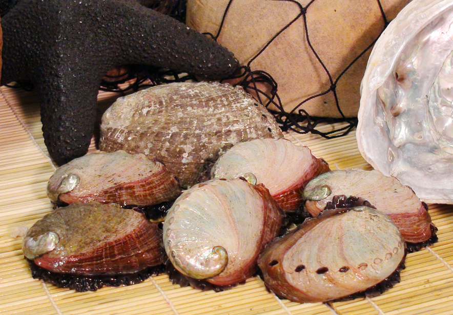

## Introduction

### The Abalone Aging App
 ======================================

* If you skipper an abalone harvesting boat, you know how fragile the fisheries are. 
* A big risk is getting the day's catch confiscated for taking young shells.
* Your experienced eye is paramount, but what if you had a bit of science on your side?
* The _Abalone Aging App_ , which can run from your smartphone or tablet,  uses data from the Marine Research Laboratories - Taroona, Tasmania to give an estimate the age of a freshly harvested shell.
* The measurements are all non-invasive, enabling safe return if the specimen is too young.
  
  
  
  
 ~~~~~~~~~~~~~~~~~~~~~~~~~~~~~~~~~~~~~~~~~~~~~~~~~~~~~~~~~~~~~~~~~~~~~~
 *Please note, this application was developed as a programming exercise and CANNOT be used commercially! *

--- .class #id transition:rotate

### The measurements and observations

* Sex - look at the underside: do you see testes (Male), Ovaries (Female) or nothing definite (Immature)? If unsure record immature.
* Length - with calipers, measure the longest axis if the shell (in mm)
* Diameter - with calipers, measure the greatest width of the shell (in mm)
* Height - with calipers, measure the distance from the flesh underneath to the top of the shell (in mm)
* Weigh the shell (in g)

--- .class #id 

### The result
The app is available at [https://jw149j.shinyapps.io/assess/](https://jw149j.shinyapps.io/assess/). 

Enter the sex details using the radio button in the panel on the left.  
   
Enter the measurements by shifting the sliders 
  
Read the estimated age of the shell at the bottom. 

--- .class #id

### Appendix - Performance of the linear regression model.

* The regression model was used to estimate the ages of ~ 1100 specimens with ages independently determined by ring count. None of these specimens were used in the construction of the model.
  
* The plot shows the relationship between the actual ages of the shells, and the estimate provided by the model.

